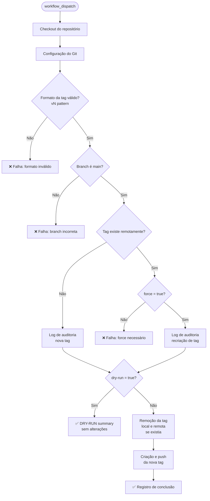

# Design Document

## tag-management-workflow

---

## Overview

O `tag-management-workflow` é um workflow GitHub Actions acionado manualmente (`workflow_dispatch`) para gerenciar tags estáveis no formato `vN` (ex: `v1`, `v2`, `v3`). Ele opera exclusivamente na branch `main` e suporta criação de novas tags, recriação de tags existentes (com proteção via flag `force`) e modo dry-run para simulação sem efeitos colaterais.

Diferente dos demais workflows do repositório — que usam `workflow_call` e são componentes reutilizáveis — este workflow é um ponto de entrada operacional acionado diretamente por engenheiros de plataforma via interface do GitHub ou GitHub CLI.

**Decisão de design:** O uso de `workflow_dispatch` em vez de `workflow_call` é intencional. Gerenciamento de tags é uma operação administrativa pontual, não um componente de pipeline reutilizável. A restrição à branch `main` é implementada via verificação explícita no primeiro step, pois `workflow_dispatch` não suporta restrição de branch nativa de forma confiável em todos os contextos.

---

## Architecture



O fluxo é linear e sequencial dentro de um único job. Cada step tem responsabilidade única e falha explicitamente com mensagem descritiva quando uma pré-condição não é atendida.

---

## Components and Interfaces

### Trigger

```yaml
on:
  workflow_dispatch:
    inputs:
      tag-version:   # obrigatório, string
      dry-run:       # opcional, boolean, default: false
      force:         # opcional, boolean, default: false
      runs-on:       # opcional, string, default: ubuntu-latest
```

### Job: `manage-tag`

Único job do workflow. Executa no runner configurado via `inputs.runs-on`.

### Steps

| # | Nome | Responsabilidade |
|---|------|-----------------|
| 1 | Checkout do repositório | `actions/checkout@v4` com `fetch-depth: 0` |
| 2 | Configuração do Git | Define `user.email` e `user.name` para operações de tag |
| 3 | Validação do formato da tag | Regex `^v[0-9]+$` contra `inputs.tag-version` |
| 4 | Verificação de existência da tag remota | `git ls-remote --tags origin` |
| 5 | Validação de proteção contra sobrescrita | Falha se tag existe e `force=false` |
| 6 | Log de auditoria / dry-run summary | Registra operações planejadas; encerra se `dry-run=true` |
| 7 | Remoção da tag local e remota | Executado somente se tag já existia |
| 8 | Criação e push da nova tag | `git tag` + `git push origin` |
| 9 | Registro de conclusão | Log final com nome da tag, commit hash e actor |

### Variáveis de ambiente compartilhadas entre steps

Os steps de shell compartilham estado via `$GITHUB_ENV` e `$GITHUB_OUTPUT`:

- `TAG_EXISTS` — `true` ou `false`, definido no step 4
- `PREVIOUS_COMMIT` — hash do commit anterior da tag (se existia), definido no step 4
- `CURRENT_COMMIT` — hash do commit HEAD da main, definido no step 3

---

## Data Models

### Inputs do workflow

| Input | Tipo | Obrigatório | Padrão | Descrição |
|-------|------|-------------|--------|-----------|
| `tag-version` | `string` | sim | — | Versão da tag estável a ser criada ou recriada. Exemplo: v1, v2, v3 |
| `dry-run` | `boolean` | não | `false` | Simula as operações sem aplicá-las. Nenhuma tag será criada, removida ou atualizada |
| `force` | `boolean` | não | `false` | Permite sobrescrever uma tag existente. Obrigatório quando a tag já existe |
| `runs-on` | `string` | não | `ubuntu-latest` | Runner a ser utilizado |

### Formato de tag válido

Padrão: `^v[0-9]+$`

Exemplos válidos: `v1`, `v2`, `v10`, `v100`
Exemplos inválidos: `v1.0`, `1`, `v`, `v1-beta`, `V1`

### Mensagens de log de auditoria

**Nova tag (criação):**
```
[AUDIT] Actor: <github.actor>
[AUDIT] Operation: CREATE
[AUDIT] Tag: <tag-version>
[AUDIT] Commit: <CURRENT_COMMIT>
```

**Tag existente (recriação):**
```
[AUDIT] Actor: <github.actor>
[AUDIT] Operation: RECREATE
[AUDIT] Tag: <tag-version>
[AUDIT] Previous commit: <PREVIOUS_COMMIT>
[AUDIT] New commit: <CURRENT_COMMIT>
```

**Dry-run:**
```
[DRY-RUN] Would <CREATE|RECREATE> tag <tag-version>
[DRY-RUN] Target commit: <CURRENT_COMMIT>
[DRY-RUN] No changes applied.
```

---

## Correctness Properties

*A property is a characteristic or behavior that should hold true across all valid executions of a system — essentially, a formal statement about what the system should do. Properties serve as the bridge between human-readable specifications and machine-verifiable correctness guarantees.*


### Property 1: Validação de branch

*Para qualquer* valor de `GITHUB_REF`, se o valor não for `refs/heads/main`, o step de validação de branch deve encerrar com código de saída não-zero e exibir mensagem de erro. Se o valor for `refs/heads/main`, o step deve prosseguir normalmente.

**Validates: Requirements 1.2, 1.3**

---

### Property 2: Validação do formato da tag

*Para qualquer* string fornecida como `tag-version`, o step de validação deve aceitar a string se e somente se ela corresponder ao padrão `^v[0-9]+$`. Qualquer string que não corresponda ao padrão deve causar falha com mensagem de erro descritiva.

**Validates: Requirements 2.2, 2.3**

---

### Property 3: Tag resultante aponta para HEAD

*Para qualquer* operação de tag bem-sucedida (criação ou recriação), a tag criada no repositório remoto deve apontar para o commit HEAD da branch main no momento da execução — independentemente de a tag ter existido anteriormente ou não.

**Validates: Requirements 3.1, 4.3**

---

### Property 4: Log de auditoria contém todos os campos obrigatórios

*Para qualquer* execução bem-sucedida do workflow (sem dry-run), o log de auditoria deve conter: o nome da tag, o hash do commit referenciado, e o actor que acionou o workflow. Em operações de recriação, o log deve conter adicionalmente o hash do commit anterior.

**Validates: Requirements 3.3, 4.4**

---

### Property 5: Proteção contra sobrescrita

*Para qualquer* tag que já exista remotamente, se o input `force` for `false`, o step de proteção contra sobrescrita deve encerrar com código de saída não-zero antes de qualquer operação de remoção ou criação ser executada.

**Validates: Requirements 5.3**

---

### Property 6: Invariante do modo dry-run

*Para qualquer* execução com `dry-run=true`: (a) todas as validações de formato, branch, existência e proteção contra sobrescrita devem executar normalmente e produzir os mesmos resultados que em modo normal; (b) todas as operações planejadas devem ser registradas no log com prefixo `[DRY-RUN]`; (c) nenhuma operação de criação, remoção ou push de tag deve ser executada — o conjunto de tags no repositório remoto deve ser idêntico antes e depois da execução.

**Validates: Requirements 6.1, 6.2, 6.3**

---

## Error Handling

| Condição | Step | Comportamento |
|----------|------|---------------|
| Branch não é `refs/heads/main` | Validação de branch | `exit 1` com mensagem: `"Este workflow só pode ser executado na branch main."` |
| `tag-version` não corresponde a `^v[0-9]+$` | Validação do formato | `exit 1` com mensagem: `"Formato inválido: '<valor>'. Use o padrão vN (ex: v1, v2, v3)."` |
| Tag existe e `force=false` | Proteção contra sobrescrita | `exit 1` com mensagem: `"A tag '<tag>' já existe. Defina force: true para sobrescrever."` |
| Falha no `git push` (tag ou remoção) | Criação/remoção da tag | Falha nativa do comando git; o step encerra com código de saída não-zero |
| `dry-run=true` após validações | Log de auditoria | Encerra com `exit 0` após imprimir o dry-run summary — sem executar operações de tag |

Nenhum step usa `continue-on-error: true`. A falha em qualquer step encerra o job imediatamente, garantindo que operações parciais não ocorram.

---

## Testing Strategy

### Avaliação de PBT

Este workflow é um arquivo YAML de GitHub Actions — infraestrutura declarativa com steps de shell. A lógica de negócio está nos scripts bash inline. PBT é aplicável para as funções de validação (formato da tag, verificação de branch) e para a lógica de decisão (create vs recreate, dry-run vs normal), pois essas funções têm comportamento que varia significativamente com o input.

Para operações que envolvem git remoto (push, delete), PBT não é adequado — usar testes de integração com repositório local.

### Testes unitários (scripts bash)

Extrair as funções de validação para scripts testáveis isoladamente:

- **Validação de formato**: testar com exemplos válidos (`v1`, `v10`, `v100`) e inválidos (`1`, `v`, `v1.0`, `V1`, `v1-beta`, string vazia)
- **Validação de branch**: testar com `refs/heads/main` (passa) e qualquer outro valor (falha)
- **Lógica de proteção**: testar combinações `(TAG_EXISTS=true, force=false)` → falha; `(TAG_EXISTS=true, force=true)` → passa; `(TAG_EXISTS=false, force=*)` → passa

### Testes de propriedade (property-based)

Biblioteca recomendada: **[bats-core](https://github.com/bats-core/bats-core)** para testes de shell + geração de inputs via bash.

Para cada propriedade do design:

**Property 1 — Validação de branch:**
Gerar strings aleatórias de refs (ex: `refs/heads/feature-*`, `refs/tags/*`, strings arbitrárias) e verificar que apenas `refs/heads/main` passa. Mínimo 100 iterações.
Tag: `Feature: tag-management-workflow, Property 1: branch validation`

**Property 2 — Validação de formato:**
Gerar strings aleatórias e verificar que o resultado da validação é equivalente a testar `^v[0-9]+$`. Incluir edge cases: string vazia, apenas `v`, `V1` (maiúsculo), `v1.0`, `v1-beta`. Mínimo 100 iterações.
Tag: `Feature: tag-management-workflow, Property 2: tag format validation`

**Property 3 — Tag aponta para HEAD:**
Usar repositório git local (sem remote real). Para qualquer tag válida (existente ou não), após execução do workflow, verificar que `git rev-parse <tag>` retorna o mesmo hash que `git rev-parse HEAD`. Mínimo 100 iterações com diferentes commits e nomes de tag.
Tag: `Feature: tag-management-workflow, Property 3: tag points to HEAD`

**Property 5 — Proteção contra sobrescrita:**
Para qualquer tag existente no repositório local, executar o workflow com `force=false` e verificar que o step de proteção falha antes de qualquer operação de remoção. Mínimo 100 iterações com diferentes nomes de tag.
Tag: `Feature: tag-management-workflow, Property 5: overwrite protection`

**Property 6 — Invariante dry-run:**
Para qualquer combinação de inputs válidos com `dry-run=true`, verificar que: (a) o conjunto de tags antes e depois é idêntico; (b) o log contém `[DRY-RUN]`; (c) validações ainda executam. Mínimo 100 iterações.
Tag: `Feature: tag-management-workflow, Property 6: dry-run invariant`

### Testes de integração

Executar o workflow completo contra um repositório git local com remote mockado:

- Criação de tag inexistente (happy path)
- Recriação de tag existente com `force=true`
- Falha com tag existente e `force=false`
- Dry-run em ambos os cenários (tag existente e inexistente)
- Falha com branch incorreta
- Falha com formato de tag inválido

### Testes de smoke (YAML)

Inspecionar o arquivo `tag-management-workflow.yaml` para verificar:

- Trigger é `workflow_dispatch`
- Todos os inputs declarados com tipos e descriptions corretos
- `fetch-depth: 0` presente no checkout
- Steps na ordem especificada pelos requisitos
- Nenhum `continue-on-error: true` em steps críticos
- Nenhum secret ou credencial hardcoded
